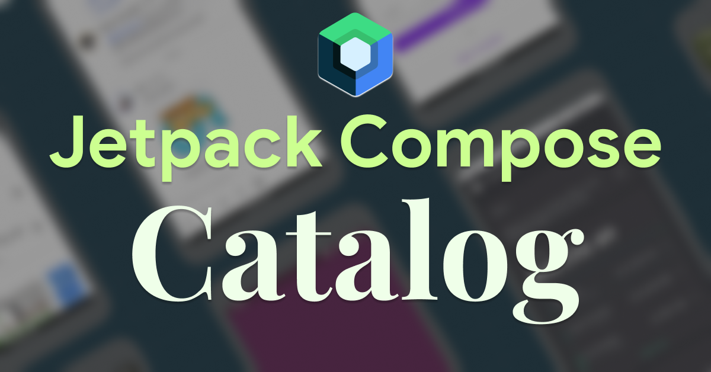

# JetpackCompose.app

[JetpackCompose.app](https://jetpackcompose.app/) is a website that helps you
learn more about the biggest change in Android development since its inception.
It consists of tools, tutorials, resources and examples that help you level up
your Jetpack Compose knowledge.

There are 4 main sections in the website:

<table align="center" style="width:100%">
    <tr>
        <td></td>
        <td><a href="http://jetpackcompose.app/compose-catalog">Compose Catalog</a> - The most reliable source for finding the latest libraries, tools and & examples about Jetpack Compose.</td>
    </tr>
    <tr>
        <td><a href="http://jetpackcompose.app/What-is-the-equivalent-of--in-Jetpack-Compose">Which Compose API to use?</a> - An IFTTT'esque tool that lets you enter an API/Widget from classic Android and makes a recommendation for the corresponding API to use in Jetpack Compose.</td>
        <td></td>
    </tr>
    <tr>
        <td></td>
        <td><a href="http://jetpackcompose.app/quick-bites">Compose Quick Bites</a> - Easy-to-consume bite sized content about the core concepts of Jetpack Compose.</td>
    </tr>
    <tr>
        <td><a href="http://jetpackcompose.app/faq">FAQ's</a> - The most common questions about Compose answered with links to relevant sources.</td>
        <td></td>
    </tr>
</table>

## Tech Stack

The website uses the following frameworks & tools:

- [Gatsby](https://www.gatsbyjs.com/)
- [Vercel](https://vercel.com/) for hosting the site and continuous deployments
- [React](https://reactjs.org/)
- [Forestry](https://forestry.io/) - CMS layer so that I can organize the
  content of the site. All the content is stored within this repo itself in json files. You can find them [here](src/data)

<br/>

The table below illustrates links you to the relevant folders for each part of
the website. **If you want to update any of the content on the site, you can
simply do so by updating the corresponding data/content json files**. It's intentionally
lightweight so that anyone can contribute.

<table align="center" style="width:100%">
    <tr>
        <td>Compose Catalog</td>
        <td>
            <a href="src/components/catalog">UI Code</a> <br/>
            <a href="src/data/catalog.json">Content/Data</a>
        </td>
    </tr>
    <tr>
        <td>Which Compose API to use?</td>
        <td>
            <a href="src/components/ifttt">UI Code</a> <br/>
            <a href="src/data/ifttt.json">Content/Data</a>
        </td>
    </tr>
    <tr>
        <td>Compose Quick Bites</td>
        <td>
            <a href="src/components/quickbites">UI Code</a> <br/>
        </td>
    </tr>
    <tr>
        <td>FAQ's</td>
        <td>
            <a href="src/components/faq">UI Code</a> <br/>
            <a href="src/data/faq.json">Content/Data</a>
        </td>
    </tr>
</table>

## Building the website

1. The site uses Github API for pulling the stars for github project that are added to Compose Catalog. In order to use it properly, [generate a personal access token](https://docs.github.com/en/free-pro-team@latest/github/authenticating-to-github/creating-a-personal-access-token) and copy it.

2. Since the site uses Gatsby, it has two modes for compiling a site:

Develop - run with the `GITHUB_TOKEN=<TOKEN_FROM_STEP_1> gatsby develop` command

Build - run with `GITHUB_TOKEN=<TOKEN_FROM_STEP_1> gatsby build` and then `gatsby serve`


## Contributing

Pull requests are welcome! I'd love your help in improving the website. Feel
free to browse through open issues to look for things that need work. If you
have a new idea or want to suggest improvements, just open a new issue and we
can discuss it there 🙏

## License

```
Copyright 2020 Vinay Gaba.

Licensed under the Apache License, Version 2.0 (the "License");
you may not use this file except in compliance with the License.
You may obtain a copy of the License at

   http://www.apache.org/licenses/LICENSE-2.0

Unless required by applicable law or agreed to in writing, software distributed under the License is distributed on an "AS IS" BASIS, WITHOUT WARRANTIES OR CONDITIONS OF ANY KIND, either express or implied. See the License for the specific language governing permissions and limitations under the License.
```
